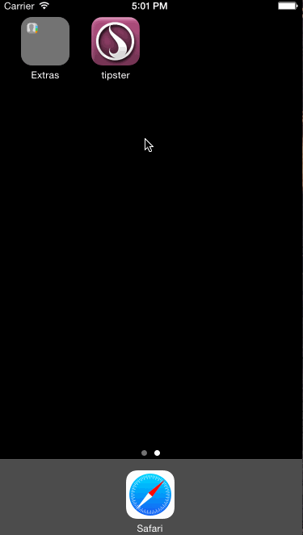

# Tipster - a tip calculator

This calculates the expected tip, given a total and a desired percentage. It supports saving the default tip percentage via `NSUserDefaults`.

Time spent: 4 hours

This follows the basic template, plus a few extras:

* Native currency + number display formatting via `NSNumberFormatter`
* `DefaultPreferences.plist` establishes defaults for `NSUserDefaults` on app launch
* Some method factoring to make the event handlers simpler to read

## Walkthrough

